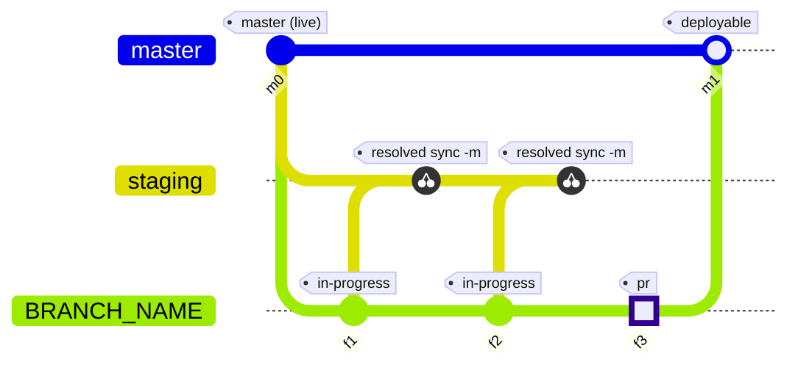

Workflows
=========

Git workflow for application with staging and live environment.
All features are merged with the staging branch (`WF_STAGING_BRANCH`, default `staging`) and from there- released on staging system.
When feature is ready - it is merged with the production branch (`WF_PROD_BRANCH`, default `master`) and from there released to live system.

# Usage

Run `gitflow` from inside the target clone (any subdirectory). The tool acts on that repository - the remote and the repository root are read from it, so there is nothing to configure per project.

Tool expects that you have previously cloned the production branch to your local system.

Tool works with SSH so you need to have set up SSH key pairs.

`config.sh` is optional. Create a copy of sample.config.sh as config.sh only if you want the debug flags; without it both default to `0`:

```
#!/bin/bash
## configuration values

export WF_DEBUG=0
export WF_VERBOSE=0

```

* `WF_DEBUG` - set to `1` for a dry-run: print each git command and do not execute it
* `WF_VERBOSE` - not used at the moment

## Per-repo branch names

Copy [sample.dot.gitflow](sample.dot.gitflow) to `.gitflow` at the **project** repository root (committed so the team shares names). The file is dotenv `KEY=value`; unset keys keep the defaults.

```
# lecturio/some-app
WF_PROD_BRANCH=main
WF_STAGING_BRANCH=devel
```

* `WF_PROD_BRANCH` — branch deployed to the live server (default `master`)
* `WF_STAGING_BRANCH` — branch deployed to the staging server (default `staging`)

Partial files are valid. Setting only `WF_PROD_BRANCH=main` still uses staging `staging`. Repos that already use `master` and `staging` need no `.gitflow`.

Keys present in `.gitflow` override the environment. Keys omitted from the file (or when there is no file) use the environment if set, otherwise the defaults. Trailing spaces on values are ignored.

The `pr` goal derives the GitHub compare URL from the current repo's `origin` remote.

# Install

```bash
cd workflows
./install/install.sh
```

Creates symlink in `/usr/local/bin/gitflow`.

From now on `workflow.sh` command can be replaced with `gitflow`.

You can use `gitflow` in your current project dir.

# Git Commands Manifesto

Please check follwoing guide

https://github.com/lecturio/workflows/wiki/Additional-commands-during-feature-development

# Server Setup

* live server
* staging server

# Branch setup

* production branch (`WF_PROD_BRANCH`, default `master`)- deployed on `live server`
 * rebase with feature (one time)
* staging branch (`WF_STAGING_BRANCH`, default `staging`)- deployed on `staging server`
* feature
 * created from the production branch
 * cherry-picked - until feature is approved to staging (multiple times)
 * rebase with the production branch - retrieve changes from production (multiple times)

# Goals

Tool have following pattern: ./workflow.sh [FEATURE] [GOAL] [OPTION] where:

* FEATURE - XXX-001
* GOAL
 * in-progress
 * pr
 * resolved, option sync
 * deployed
 * closed
* OPTION - some goals have additional options like `resolved`

## In progress

Creates feature branch from the production branch.

### Goal
```bash
gitflow XXX-001 in-progress
```

* Create branch XXX-001 (if branch is missing on remote and in local repo). Push branch to remote.
* Switch branch from local or checkout from remote.
* Update branch from remote feature branch.


## Resolved

Review merge files before make commit to staging branch.

### Goal

```bash
gitflow XXX-001 resolved
```

Review cherry-pick changes. If merge is ok - they are ready for commit.

### Conflict
Resolving of conflicts - use `git add` or `git rm`. When conflict is resolved move to `git cherry-pick --continue`.

Use `git status` to review modified files.
Abort - restart goal.
Changes - `git log` to ensure status of your changes.

After resolving run:

```bash
gitflow XXX-001 resolved sync
```

## Resolved Sync

Option to commit changes to staging and push to staging.
Changes can be commit from IDE or with `git commit -am "Commit message"

### Goal
```bash
gitflow XXX-001 resolved sync
```

Creates tracking branches and push changes to staging remote.

```
gitflow XXX-001 resolved sync -m "Commit message"

```

Commit changes to staging branch and push changes to staging remote.


## PR

Prints the GitHub compare URL to open a pull request from the feature branch into the production branch (`WF_PROD_BRANCH`, default `master`). Does not run any git commands; the link is derived from `WF_TASK` and the current repo's `origin` URL.

### Goal

```bash
gitflow XXX-001 pr
```

* Output is a single line: `https://github.com/<org>/<repo>/compare/<prod-branch>...XXX-001?expand=1` (opens the new pull request flow in the browser when followed). For the default production branch that is `.../compare/master...XXX-001?expand=1`. Slashes in branch names are percent-encoded (`release/1.2` → `release%2F1.2`).

## Deployed

Sync changes from feature branch to the production branch. One-time operation.
After is ready branch must be `closed`. This is end of the working cycle.

### Goal

```bash
gitflow XXX-001 deployable
```

Rebase the production branch to the feature branch.
Rebase the feature branch to the production branch.
Review your changes.
Push to the production branch must be created manually - from IDE or with `git push origin <prod-branch>`.

### Conflict

Most likely conflicts are on first step - rebase production to feature branch. Rebase feature branch to production usually are fast-forwarded.

Resolving of conflicts - use `git add` or `git rm`. When conflict is resolved move to `git rebase --continue`.

Use `git status` to check where are the conflicts and on with step (rebase production to feature branch or rebase feature to production).

Abort - restart goal.
Changes - `git log` to ensure status of your changes.

After resolving conflict run again 

```bash
gitflow XXX-001 deployable
```

## Closed

### Goal

```bash
gitflow XXX-001 closed
```

script will pop out the code which needs to be executed to delete local and remote branch

## Resync the whole branch on staging again

When the staging branch is refreshed (recreated from the production branch), then all not deployed feature branches must be synced again to the new staging branch.

To achive this:
* all current tracking branches must be deleted
* the feature branch must be `resolved` in the usual way

### Commands
Deleting all tracking branches for feature with name `XXX-1234`
```bash
gitflow XXX-1234-track closed
```

This must show only branches ending with `track-#`

After executing by hand the delete branch commands, then the feature branch can be `resolved` without any problems

# Flow

Overview of how the production branch (`master` in this diagram), staging, and the feature branch `BRANCH_NAME` evolve. The diagram uses the default branch names; a repo may override them in `.gitflow`. The diagram uses [Mermaid GitGraph](https://mermaid.js.org/syntax/gitgraph.html) syntax; render it in GitHub, VS Code, or any Mermaid-capable viewer.



1. **`gitflow BRANCH_NAME in-progress`** — create the feature branch from the production branch (`master` by default) and push it (`f1` starts this line of work).
2. **`git add` / `git commit` / `git push`** — move work forward on `BRANCH_NAME` (further commits on the feature branch before each cherry-pick).
3. **`gitflow BRANCH_NAME resolved`** — bring changes onto the staging branch (shown as **cherry-pick** onto `staging`).
4. If there are conflicts, resolve them, commit, then **`gitflow BRANCH_NAME resolved sync -m "…"`** to update remote staging.
5. If more work is needed, **`gitflow BRANCH_NAME in-progress`** again and repeat push to staging via `resolved` / `resolved sync` as above (`f2` and second cherry-pick).
6. When acceptance is met on staging, **`gitflow BRANCH_NAME pr`** prints the GitHub compare URL to open a PR into the production branch (script only; the highlighted node in the graph marks that milestone, not a required commit).
7. **`gitflow BRANCH_NAME deployable`**, resolve conflicts if any, then **`git push`** to publish the production branch (`m1` merge).
8. **`gitflow BRANCH_NAME closed`** — prints the commands to delete local and remote branches; run those by hand (not shown as graph operations).

Key features

* Create feature branch from the production branch
* Push feature as remote feature branch
* Working on the feature (commit and push)
* Rebase with the production branch during feature development to be kept up to date
* Cherry-pick new changes to staging (multiple times)
* Rebase the production branch with the feature (end of flow). Start from begging.

# Completion

When `gitflow` is run for the first time it adds copletion to `~/.profile` file.

For linux execute `.  ~/.bashrc`. For other systems `. ~/.profile`.

If you lack git-completion you'll miss branches names completion in gitflow as well.
You can install [git autocompletion](https://github.com/git/git/blob/master/contrib/completion/git-completion.bash).

```bash
gitflow mas[tab] #completes local branches
gitflow origin/[tab] #completes remote branches
```

# FAQ

* Execute `gitflow XXX-001 resolved sync` before `gitflow XXX-001 resolved`
 * You need to delete latest track branch from local and remote e.g. `git push origin :XXX-001-track-[latest]` and `git branch -d XXX-001-track-[latest]`. `latest`- biggest number 1,2,3 and etc.
 * Run `gitflow XXX-001 resolved` again

* Resolved with lots of conflicts in feature branch

If you have some simmilar when you run `gitflow XXX-001 resolved` on step where feature branch is updated with its origin you get this: 

```
On branch XXX-001
Your branch and 'origin/XXX-001' have diverged,
and have 20 and 1 different commit each, respectively.
  (use "git pull" to merge the remote branch into yours)

```

but you have latest changes on remote feature branch.

* Solution 1
 * `git rebase --abort`
 * wait a while
 * run `gitflow XXX-001 resolved`

* Solution 2
 * `git checkout master` (or your `WF_PROD_BRANCH`)
 * `git branch -D XXX-001`
 * `gitflow XXX-001 in-progress`
 * `gitflow XXX-001 resolved`

It seems github needs some time for synchronization.

# Version History

Please use version 0.0.3.RELEASE

* 0.0.3.RELEASE
 * `gitflow` acts on the clone of the current directory
 * Optional repo `.gitflow` overrides production (`WF_PROD_BRANCH`) and staging (`WF_STAGING_BRANCH`) branch names
 * `pr` compare URL uses the current repo's `origin` (branch names percent-encoded)
 * `config.sh` is optional and no longer holds `WF_REPO` or `WF_PROJECT_ROOT`
 * Templates renamed to `sample.config.sh` and `sample.dot.gitflow`

* 0.0.2.RELEASE
 * Autocomplete for remote branches
 * Fixed `emit` output and usage ot `print_msg`
 * Fixed correct exist status code when `emit print_msg` is used
 * Autocompletion of branches
 * Prune local branches on goal execution
 * Fixed `quiet` execution always to finish with code 0 
 * Added goal bash auto-completion
 * -m="Comment" is -m "Comment" (without equal sign)
 * Fixed resolved sync work with tracking branches gt 10
 
* 0.0.1.RELEASE 
 * goals - resolved, in-progress, deployable
 * self update check

#TODO

* ~~`closed` goal is not implemented~~
* ~~`staging` must be called `devel`~~ (set `WF_STAGING_BRANCH` in `.gitflow`)
