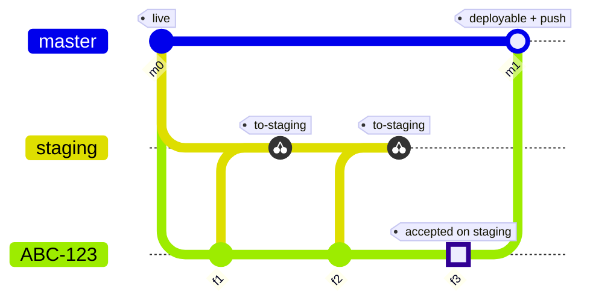

How the workflow works
======================

Three kinds of branch
---------------------

**Production** — `master` by default, `WF_PROD_BRANCH` to change it — is what runs
on the live server. Ticket branches are cut from it, and only the `deployable`
stage writes back to it, once per ticket.

**Staging** — `staging` by default, `WF_STAGING_BRANCH` to change it — is what runs
on the staging server. It is a shared integration branch that collects every
ticket in flight, so it holds work that may never reach production in that shape.
It can be recreated from production at any time; when that happens, tickets have
to be pushed onto it again (see
[staging was recreated](troubleshooting.md#staging-was-recreated)).

**Ticket branches** are named after the ticket (`ABC-123`) and carry the real
history of the change. This is the only branch you commit to directly.

The life of a ticket
--------------------

1. `gitflow ABC-123 in-progress` cuts the branch from `origin/master` and pushes
   it (`f1` starts the work).
2. You commit and push on `ABC-123` with plain git.
3. `gitflow ABC-123 pr` prints a compare link into production, for code review.
   It is opened once, early, and nothing is merged there.
4. `gitflow ABC-123 to-staging` cherry-picks the new commits onto staging, commits
   them with a message naming those commits, and records the sync. You run
   `git push origin staging`.
5. Steps 2 and 4 repeat for as long as the ticket is being reviewed on staging
   (`f2` and the second cherry-pick).
6. `gitflow ABC-123 deployable` rebases `ABC-123` onto production, then moves
   production onto it. You run `git push origin master`.
7. `gitflow ABC-123 closed` deletes the ticket's branches.

`gitflow ABC-123 resolved` and `gitflow ABC-123 resolved sync -m "…"` are the
deprecated two-step form of step 4, stopping between them so you can review the
cherry-pick. Finishing a conflicted sync is what they are still needed for; see
[deprecated stages](deprecated.md).

The diagram draws step 6 as a merge because that is what Mermaid can express.
`deployable` rebases, so production ends up carrying the ticket's own commits with
no merge commit.

Tracking branches (`ABC-123-track-N`)
-------------------------------------

Every sync — `to-staging`, or the deprecated `resolved sync` — creates and pushes
a branch called `ABC-123-track-N`, with N counting up from 1, pointing at the
ticket-branch tip that was just synced. It is a bookmark and nothing else: it
records how far staging has caught up with the ticket.

The next sync finds the highest `origin/ABC-123-track-N` and cherry-picks only
`origin/ABC-123-track-N..ABC-123`. When no tracking branch exists yet it uses
`origin/master..ABC-123`, which is the whole ticket branch.

Two consequences are worth knowing:

* Staging normally gets **one commit per sync**, squashing however many ticket
  commits went into that round. `to-staging` writes the message itself, listing
  the short shas of the commits it squashed; `resolved sync` carries the message
  you pass to `-m`. Production later gets the ticket's individual commits. The two
  branches are not meant to have matching history.

  Two rounds depart from one commit. When staging already carries everything in
  the range — someone applied it by hand — `to-staging` records the bookmark and
  commits nothing. And a round whose cherry-pick conflicted part way takes as many
  commits as it takes to get through the range, because `git cherry-pick
  --continue` cannot run over a resolution that is only staged, so each conflict
  is committed before the next commit is applied.
* **Deleting a tracking branch rewinds the bookmark**, so the next `to-staging`
  picks the commits again from wherever the previous bookmark sits. That is the
  lever behind both recovery procedures in
  [troubleshooting](troubleshooting.md).

What the tool leaves to you
---------------------------

* **It never pushes staging or production.** `to-staging`, `resolved sync` and
  `deployable` all stop with the commits in your local branch and print the push
  as their last line — `Now push it: git push origin staging`, and
  `git push origin master` from `deployable`. Pushing is a deliberate manual step.
* **It doesn't rebase your ticket branch onto production while you work.** To pick
  up production changes mid-ticket, run `git pull --rebase origin master` on the
  ticket branch yourself. `deployable` is the only stage that rebases onto
  production, at the very end.
* **It doesn't merge the pull request.** `pr` only prints a URL; production is
  updated by `deployable` plus your push.
* **It doesn't create the deployed branches.** Both production and staging must
  already exist on `origin` or the stage aborts.
